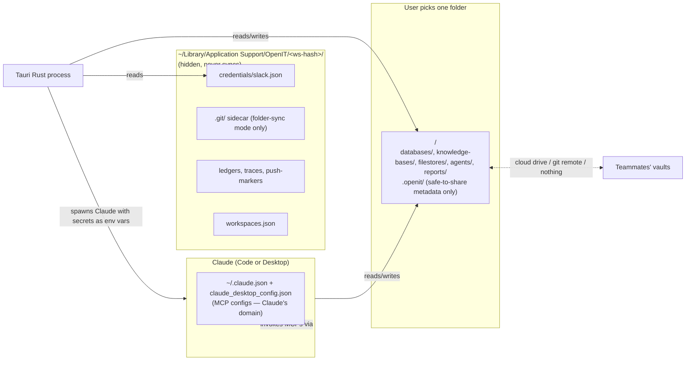

# PIN-TBD: BYO-cloud rearchitecture (Pinkfish-free, Obsidian model) — Implementation plan

**Ticket:** PIN-TBD (to be created)
**Date:** 2026-05-06
**Repo:** `openit-app` (the only repo by the end)
**References:** brief at `auto-dev/plans/2026-05-06-byo-cloud-rearchitecture-brief.md`
**Predecessor:** none (greenfield-shaped repositioning of unreleased app)

---

## 1. Technical investigation

### 1.1 Current Pinkfish coupling (everything to delete)

| Surface | Where | Disposition |
|---|---|---|
| Auth layer | `src/lib/pinkfishAuth.ts`, OS keychain entries `pinkfish.client_id`/`client_secret` | Delete entirely |
| Five entity adapters' cloud round-trips | `src/lib/{kb,filestore,datastore,agent,workflow}Sync.ts` (the `pull`/`push` halves only) | Delete cloud halves; keep local file I/O halves |
| Connections proxy + MCP gateway callers | `src/lib/api.ts` (`pinkfishListConnections`, `gateway_invoke`, capabilities discovery) | Delete |
| Project bootstrap | `src-tauri/src/project.rs:245` — vault rooted at `~/OpenIT/<orgId>/` | Strip orgId; vault root = arbitrary user-picked path |
| App bootstrap | `src/App.tsx` requires successful token exchange before loading workspace | Strip — vault is local |
| Cross-repo plugin pipeline | `openit-app/scripts/openit-plugin/` → `/web/packages/app/public/openit-plugin/` → Pinkfish CDN → `<vault>/.claude/` | Bundle plugin into Tauri app resources; copy to `<vault>/.claude/` on first launch; updates pulled from a configured GitHub URL |

### 1.2 What stays

- On-disk format (JSON + Markdown one-file-per-record)
- `syncEngine.ts` core diff loop, shadow-conflict UX, `(repo, "git")` lock — engine doesn't know Pinkfish exists; the adapters do
- `git status --short` as internal dirty-detector + `autoCommitDriver.ts` post-pull autocommit (per `auto-dev/plans/2026-04-25-bidirectional-sync-plan.md:256` — state lives in git history, not a manifest)
- Tauri shell, file explorer, intake server, agent runtime, plugin script execution, Slack listener (already BYO-creds; only relocates secrets in phase 2)
- The `.openit/` namespace inside the vault — but its contents shrink to safe-to-share metadata only

### 1.3 New architecture

Three layers, three owners. OpenIT (vault + UI), Anthropic (Claude runtime), MCP ecosystem (third-party connectors). OpenIT never holds non-Slack third-party credentials.

### 1.4 Vault hygiene rule (architectural invariant)

Cloud drives don't honor `.gitignore`. Therefore:

- **Inside the vault** = anything that should be visible to every teammate. By construction contains zero credentials.
- **App support** = anything per-user. Credentials, sidecar `.git/`, ledgers, traces, push-markers, workspace registry.

This invariant is enforced by a CI test: after a fresh onboarding, grep the vault for token-shaped strings — must return zero hits.

---

## 2. Proposed solution — three phases

### Phase 1 — Pinkfish-free single-repo with in-app plugin

**Deliverable:** clean clone → `npm install && npm run tauri dev` → app boots, vault works at `~/OpenIT/Personal/`, plugin ships from inside the app, zero references to `*.pinkfish.ai` or the `/web`/`/platform`/`/firebase-helpers`/`/pinkfish-connections` siblings. The grep `rg -i pinkfish src/ src-tauri/` returns zero hits.

**Approach.** Delete all Pinkfish code outright. Strip the orgId concept from the vault path. Bundle `scripts/openit-plugin/` into Tauri resources; on workspace creation, copy into `<vault>/.claude/`. Rewrite the auto-dev docs to drop the four-sibling-repo cheatsheet. Pick a license (recommend MIT for permissiveness).

**Files to modify**

| File | Change |
|---|---|
| `src/lib/pinkfishAuth.ts` | Delete |
| `src/lib/api.ts` | Delete all `pinkfish*` exports + `gateway_invoke` + capabilities discovery; trim to Slack-validation helpers + Tauri IPC wrappers |
| `src/lib/{kb,filestore,datastore,agent,workflow}Sync.ts` | Delete the `pull`/`push` cloud halves; keep the local file-I/O halves the engine drives |
| `src/lib/syncEngine.ts` | Drop cloud-side branches in the diff loop; engine becomes "dirty-detector + autocommit + shadow-conflict on local mtime change" |
| `src/lib/pushAll.ts` | Becomes "autocommit any dirty files" — the previous remote push step is gone |
| `src-tauri/src/project.rs:245` | Default vault path: `~/OpenIT/Personal/` (no orgId); accept arbitrary path param for phase 2's picker |
| `src/App.tsx` | Boot loads the workspace directly; no auth gate |
| `src/shell/Shell.tsx` | Remove cloud-only banners/CTAs |
| `src-tauri/tauri.conf.json` | Bundle `scripts/openit-plugin/` as a Tauri resource |
| `src-tauri/src/project.rs` (new helper) | On vault create, copy bundled plugin → `<vault>/.claude/`; record version in app-support `plugin-version.json` |
| New: `src-tauri/src/plugin_updater.rs` | "Check for plugin updates" against configured GitHub raw URL; manual button in UI |
| `auto-dev/00-autodev-overview.md` | Rewrite — drop four-sibling cheatsheet; document single-repo flow |
| `auto-dev/06-PR.md` | Drop "mirror to /web at merge time" step |
| `auto-dev/01-brief.md`, `02-impl.plan.md` | Strip references to sibling repos |
| `README.md` (root) | Contributor-oriented setup |
| `LICENSE` | MIT |
| `package.json` | Description / keywords / repo URL pointed at OSS home |
| `src-tauri/scripts/README.md` | Strip Pinkfish references; the keychain-bypass setup stays (it's about dev signing, not Pinkfish) |
| OS keychain entries | Code that wrote `pinkfish.client_id` / `pinkfish.client_secret` is gone; document one-time cleanup command in README |

**Unit tests**

- `syncEngine.test.ts`: rewrite cloud-coupled tests to assert local-only behavior (autocommit fires on dirty, shadow file appears on simulated external write, no remote calls). Cloud-mocked tests get deleted with their adapters.
- `pushAll.test.ts`: assert it's now just "autocommit dirty paths"; no network mocks remain.
- `plugin_updater.rs`: version compare, download, idempotent re-apply against a fake GitHub URL.
- `project.rs` Rust tests: `init_project(path)` accepts arbitrary path; on first init, plugin resources land in `<path>/.claude/`.

**Manual scenarios**

1. Clean clone in tempdir, `npm install`, `npm run tauri dev` → app launches with no errors. Vault at `~/OpenIT/Personal/`. File explorer shows the standard layout. Plugin scripts present in `<vault>/.claude/scripts/`.
2. Edit a ticket file → autocommits to inline `.git/` (still inside vault — folder-sync mode arrives in phase 2). No network activity.
3. Configure Slack with BYO bot token (existing flow at `<vault>/.openit/slack.json`) → listener works; tickets ingest. Note: relocation to app-support comes in phase 2.
4. `rg -i pinkfish src/ src-tauri/` → zero hits.
5. `lsof -i` while app is running and idle → no connections to `*.pinkfish.ai`.

---

### Phase 2 — Multi-workspace, sync modes, sidecar `.git/`, secrets relocation, simplified UI, new onboarding

**Deliverable:** user can place a vault anywhere on disk. Three sync modes work end-to-end (local / folder / git). In folder-sync mode, `<vault>/.openit/` contains zero credentials and `<vault>/.git/` does not exist (sidecar lives in app-support). In local-only and folder-sync modes, no commit/push/Sync UI is visible — saving a file is the entire sync gesture. In git mode, plain-English Pull/Commit/Push controls work. New stack-picker onboarding takes a fresh user from launch to ready in four steps. The vault-hygiene grep returns zero token hits.

**Approach.** This phase is the bulk of the change. Three tightly coupled workstreams that ship together:

(a) **Multi-workspace + vault config.** Workspace registry at `~/Library/Application Support/OpenIT/workspaces.json`. Per-vault `<vault>/.openit/vault.json` carries `syncMode`. Sidebar workspace switcher. First-launch routes to onboarding.

(b) **Sync modes + sidecar git.** `RepoLayout` enum (`InsideVault | Sidecar(PathBuf)`) threaded through every Rust git callsite. Folder-sync vaults get a sidecar at `~/Library/Application Support/OpenIT/repos/<workspace-hash>/.git/`. UI gates Sync tab + push controls to `git` mode only.

(c) **Secrets out of vault.** `<vault>/.openit/slack.json` → `~/Library/Application Support/OpenIT/<ws-hash>/credentials/slack.json` at `0o700`. New Tauri command surface `get_secret(name) / set_secret(name, value)`. Plugin scripts read secrets from `process.env.*`, populated by Tauri at spawn time. Other runtime state in `.openit/` (ledgers, traces, push-markers) also moves to app-support.

**Files to modify**

| File | Change |
|---|---|
| New: `src-tauri/src/workspaces.rs` | Registry CRUD; Tauri commands `list_workspaces`, `create_workspace(path, name, sync_mode)`, `set_active_workspace(path)` |
| `src-tauri/src/project.rs` | `init_project(path, sync_mode)`; if `folder`, sidecar `.git/` initialized with `--work-tree=<vault>`; vault gets `.openit/vault.json` |
| New: `src-tauri/src/secrets.rs` | `get_secret`/`set_secret` Tauri commands; `credentials/` dir created `0o700` |
| `src-tauri/src/git_ops.rs` | Introduce `RepoLayout` enum; one helper `git_command_for(workspace) -> Command` that resolves `GIT_DIR`/`GIT_WORK_TREE`; **all callers go through it**; CI grep asserts no raw `Command::new("git")` outside the helper |
| `src-tauri/src/git_history.rs` | Same `RepoLayout` plumbing |
| `src-tauri/src/watcher.rs:75` | `.git/` path filter generalizes to "ignore configured git dir for this workspace" |
| `src-tauri/src/slack.rs` | Read tokens via `secrets.rs`, not `<vault>/.openit/slack.json` |
| `src-tauri/src/intake.rs` | Push-markers `push-request.json` / `push-result.json` move to app-support |
| `src-tauri/src/claude.rs` | When spawning Claude or any plugin script, populate env from `secrets.rs` for registered secrets (e.g. `SLACK_BOT_TOKEN`, `SLACK_APP_TOKEN`) |
| `scripts/openit-plugin/slack-*.mjs` | Read from `process.env.SLACK_*` instead of `.openit/slack.json` |
| New: `src/lib/vaultConfig.ts` | TS reader for `<vault>/.openit/vault.json`; cached per workspace |
| New: `src/shell/Onboarding.tsx` | Four-step stack picker: vault location → sync mode → optional ingress (ngrok / Cloudflare / Tailscale / none) → optional Slack token paste; every step skippable |
| New: `src/shell/WorkspaceSwitcher.tsx` | Sidebar dropdown |
| `src/App.tsx` | Empty registry → `Onboarding`; otherwise load `lastOpenedAt` |
| `src/shell/Shell.tsx` | Sync tab gated to `syncMode === "git"`; render `WorkspaceSwitcher` |
| `src/shell/FileExplorer.tsx` | Hide git-status badges when `syncMode !== "git"`; conflict markers always shown |
| `src/shell/SyncPanel.tsx` (existing v0.2.4 panel) | Mounted only in git mode; rewrite labels to plain English ("Save changes for the team", "Get teammates' changes") |
| New: CI test `vault-hygiene.test.ts` | After fresh onboarding in folder-sync mode, walk vault tree; assert zero matches against token-shaped regex set (`xoxb`, `xapp`, `xoxe`, `sk-`, `ghp_`, `Bearer `) |

**Unit tests**

- `workspaces.rs` Rust: registry round-trip, duplicate-path rejection, nested-vault rejection.
- `secrets.rs` Rust: round-trip, missing → `None`, dir is `0o700`.
- `git_ops.rs` Rust: with `RepoLayout::Sidecar(tempdir)`, `git status` against a vault that has no inline `.git/` works; `--git-dir`/`--work-tree` resolve correctly.
- `vaultConfig.test.ts`: parse, default-fill, round-trip.
- `Onboarding.test.tsx`: each step advances; "Skip" works at each step.
- `vault-hygiene.test.ts`: the assertion described above (CI, not just manual).
- `slack.rs` Rust: listener reads tokens from app-support; existing socket-mode flow unchanged.

**Manual scenarios**

1. Onboard fresh: pick `~/Dropbox/TeamVault/`, mode `folder` → no `.git/` in vault; sidecar exists at `~/Library/Application Support/OpenIT/repos/<hash>/.git/`; `<vault>/.openit/` has no `slack.json`; `~/Library/Application Support/OpenIT/<ws>/credentials/slack.json` exists at `0o600` after Slack token paste.
2. Edit a ticket → autocommit to sidecar (`git --git-dir=... log` shows it); cloud drive sees the file change; no Sync UI visible.
3. Simulate teammate edit (`cp` an externally-modified file into the vault) → file watcher fires, conflict shadow appears, resolution flow works.
4. Create a second workspace `~/OpenIT/GitMode/` mode `git` → vault has inline `.git/`; Sync tab visible with plain-English Pull/Commit/Push.
5. Switch back to Dropbox vault via `WorkspaceSwitcher` → app reloads into folder-sync vault; Sync UI hides again.
6. `rg -E '(xoxb|xapp|xoxe|sk-|ghp_|Bearer )' ~/Dropbox/TeamVault/` → zero hits.
7. Run an agent that needs Slack token → Tauri spawns Claude with env injected; agent succeeds without reading any vault credential file.

---

### Phase 3 — Connectors view + MCP integration

**Deliverable:** new "Connectors" sidebar entry shows MCPs installed in Claude Desktop and Claude Code, plus team-recommended MCPs from `<vault>/.openit/mcp-team-config.json`. Each row: status (`installed locally` / `not installed locally` / `version mismatch`). Clicking "Install" surfaces a `/install-mcp <name>` slash command. Running it in Claude Code walks through env-var prompts and edits the user's own Claude config — OpenIT itself never writes Claude's config files. Two teammates on the same vault see each other's installed MCPs surfaced in the team list.

**Approach.** Three pieces:

(a) **Discovery.** Tauri command `list_mcps` reads `~/Library/Application Support/Claude/claude_desktop_config.json`, `~/.claude.json`, and `<vault>/.mcp.json` if present; merges into a single list with source attribution; missing files are tolerated.

(b) **Team manifest.** `<vault>/.openit/mcp-team-config.json` — `[{ name, package, requiredEnvVars: [...], description }]`. **Never credentials.** Synced via the vault like any other file. Connectors view diffs against `list_mcps()` for status.

(c) **Slash-command installer.** New skill `scripts/openit-plugin/skills/install-mcp.md` + helper `scripts/openit-plugin/install-mcp.mjs`. The skill prompts for required env vars, writes user's Claude config, and offers to add the entry to the team manifest.

**Files to modify**

| File | Change |
|---|---|
| New: `src-tauri/src/mcp.rs` | `list_mcps` Tauri command; tolerant parser for Claude config formats; merge with source attribution |
| New: `src/shell/ConnectorsView.tsx` | Grid view with status badges + "Install" CTA that surfaces the runnable slash command |
| New: `schemas/mcp-team-config.json` | Schema for the synced team manifest |
| New: `scripts/openit-plugin/skills/install-mcp.md` | Slash command body |
| New: `scripts/openit-plugin/install-mcp.mjs` | Helper script the skill invokes; writes Claude config with backup; offers team-manifest update |
| `src/shell/Shell.tsx` | New "Connectors" sidebar entry |

**Unit tests**

- `mcp.rs` Rust: parse Claude Desktop format, Claude Code format, project `.mcp.json`; merge dedup by name; missing files → empty slice.
- `ConnectorsView.test.tsx`: status badges across the four states.
- `install-mcp.mjs`: dry-run mode prints the config-edit it would make without writing; backup-on-write produces a `.openit-backup-<ts>` file.

**Manual scenarios**

1. Have Google Calendar MCP installed in Claude Desktop only → Connectors view shows `installed locally`, source `Claude Desktop`.
2. Open same vault on a second machine → Connectors view shows Google Calendar as `not installed locally` (team manifest knows about it). Click "Install" → `/install-mcp google-calendar` surfaced. Run in Claude Code → walks through env-var prompt, writes user's `~/.claude.json` (with backup file written), refresh view → now `installed locally`.
3. Edit team manifest by hand to bump version → row shows `version mismatch`.
4. Verify OpenIT itself never wrote Claude's config: `stat -f %m` on `~/.claude.json` and `claude_desktop_config.json` before and after install → only the slash-command run touches them.

---

## 3. Implementation checklist

### Phase 1 — Pinkfish-free single-repo with in-app plugin

- [ ] Delete `pinkfishAuth.ts`, all Pinkfish exports in `api.ts`, the cloud halves of the five entity adapters, and cloud-side branches in `syncEngine.ts` / `pushAll.ts`
- [ ] Strip orgId from vault path; default `~/OpenIT/Personal/`
- [ ] Strip auth gate from `App.tsx`; vault loads directly
- [ ] Bundle `scripts/openit-plugin/` as Tauri resources; first-launch copy to `<vault>/.claude/`
- [ ] `plugin_updater.rs` with configured-GitHub-URL fetch
- [ ] Rewrite `auto-dev/00-autodev-overview.md`, `01-brief.md`, `02-impl.plan.md`, `06-PR.md` to drop sibling repos
- [ ] Root `README.md` for contributors; `LICENSE` (MIT); `package.json` metadata
- [ ] Update existing tests; delete tests for deleted code paths
- [ ] **Manual sign-off:** clean clone in tempdir → install → tauri dev → app runs → Slack works → `rg -i pinkfish src/ src-tauri/` returns zero → `lsof -i` shows no `*.pinkfish.ai`

### Phase 2 — Multi-workspace, sync modes, sidecar `.git/`, secrets relocation, simplified UI, new onboarding

- [ ] `workspaces.rs` registry + Tauri commands; `init_project(path, sync_mode)`
- [ ] `vault.json` schema + `vaultConfig.ts` reader
- [ ] `RepoLayout` enum threaded through `git_ops.rs` + `git_history.rs`; single `git_command_for` helper; CI grep asserts no raw `Command::new("git")` outside it
- [ ] Sidecar `.git/` flow for folder-sync mode; `watcher.rs` filter generalized
- [ ] `secrets.rs` Tauri commands; `credentials/` at `0o700`
- [ ] `slack.rs` reads from `secrets.rs`; plugin Slack scripts switch to `process.env.*`; Tauri Claude-spawn injects registered secrets
- [ ] All `<vault>/.openit/` runtime state (ledgers, traces, push-markers) moves to app-support
- [ ] `Onboarding.tsx` four-step stack picker
- [ ] `WorkspaceSwitcher.tsx` in sidebar
- [ ] Sync tab + push UI gated to `git` mode; SyncPanel labels rewritten plain-English
- [ ] FileExplorer git-status badges hidden in non-git modes
- [ ] CI `vault-hygiene.test.ts` enforces token-grep returns zero
- [ ] **Manual sign-off:** onboard fresh into `~/Dropbox/TeamVault/` mode `folder` → no `.git/` in vault → no creds in vault → no Sync UI → Slack listener works → simulated colleague edit triggers conflict shadow → switch to `~/OpenIT/GitMode/` mode `git` → Pull/Commit/Push controls visible and functional

### Phase 3 — Connectors view + MCP integration

- [ ] `mcp.rs` discovery + merge across config sources (tolerant)
- [ ] `mcp-team-config.json` schema; lives in vault, syncs naturally
- [ ] `ConnectorsView.tsx` with status-badge logic
- [ ] `install-mcp` skill + helper script (writes Claude config with backup, never writes from OpenIT directly)
- [ ] **Manual sign-off:** install Google Calendar MCP via `/install-mcp` from Connectors view → row updates to `installed locally` → second machine on same vault shows `not installed locally` until they install → backup file written; OpenIT process never touched Claude's config files

---

## 4. Stop. Ask the human to review and approve before stage 03.

## 5. Update the Linear ticket

Pending — PIN-#### needs to be created.

---

## Appendix — Risks and watch-outs

- **Phase 2 git plumbing.** Single-helper enforcement (`git_command_for`) is the only thing keeping sidecar mode honest. The CI grep is the test that catches future regressions; landing it as part of phase 2 is non-negotiable.
- **Phase 2 secret refactor breaks plugin scripts.** Any script that reads `<vault>/.openit/slack.json` will silently fail post-move. Search exhaustively in `scripts/openit-plugin/` before phase 2 ships; `vault-hygiene.test.ts` plus the manual Slack flow catch the regression.
- **Phase 3 Claude config schema drift.** Anthropic may change `claude_desktop_config.json` shape. The parser must be tolerant — unknown fields preserved on round-trip, missing fields default sensibly. Backup-on-write in the slash command means schema-drift damage is recoverable.
